  

## About Me

I'm a student and web developer who enjoys building clean, practical, and user-friendly projects.  
I like learning new things, solving real problems with code, and improving my skills step by step.

- 🔭 I'm currently working on personal coding projects  
- 👯 I'm looking to collaborate on interesting developer projects  
- 🤝 I'm looking for help with improving problem-solving and development skills  
- 🌱 I'm currently learning and exploring new technologies  
- 💬 Ask me about web development and programming  
- ⚡ Fun fact: I enjoy turning ideas into working projects  

---

### 🛠️ Tech Stack

  

---

### ✈️ Contribution Heatmap

  

---

### 📬 Connect With Me

  
  &nbsp;
  
  &nbsp;
  

